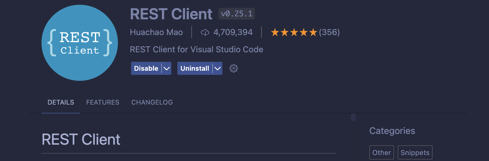
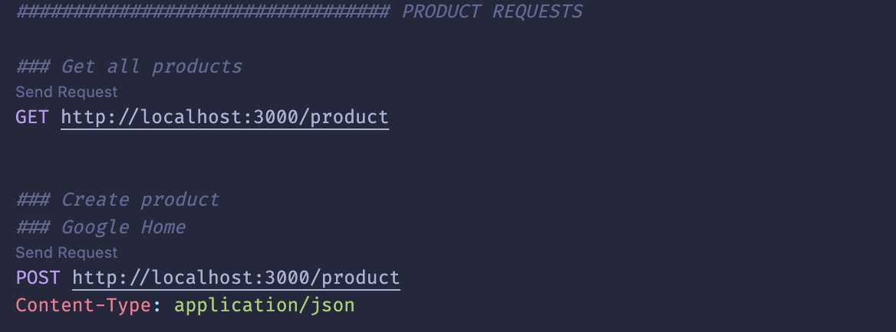

## Description

An API to calculate the total price of products in a checkout list considering current promotions.

The system should have the following promotions:

- Buy 3 Google Homes for the price of 2

- Each sale of a MacBook Pro comes with a free Raspberry Pi

- Buying more than 3 Alexa Speakers will have a 10% discount on all Alexa speakers

Example Scenarios:

- Scanned Items: MacBook Pro, Raspberry Pi B

  Total: $5,399.99

- Scanned Items: Google Home, Google Home, Google Home

  Total: $99.98

- Scanned Items: Alexa Speaker, Alexa Speaker, Alexa Speaker

  Total: $295.65

## Prerequisite

- [Node.js with NVM](https://nodejs.org/en/download/package-manager)
- [Docker](https://docs.docker.com/engine/install/)
- [Visual Studio Code](https://code.visualstudio.com/download) with the REST Client extension

<details>
  <summary>More on REST Client extension</summary>
  
  ### REST Client extension by Huachao Mao

#### What extension?



#### How?

- Simply open the `client.http` file inside the root folder on VS Code

- Click on "Send Request" next to the API call you want to execute

  

  </details>

## Installation

```bash
# Clone the repo
$ git clone https://github.com/avpalmeira/checkout-api
$ cd checkout-api

# Install the dependencies
$ npm install
```

## Running the app

```bash
# Run a PostgreSQL Database inside a container on port 5434
$ docker compose up -d

# Run the migrations
$ npm run migration:run

# Run the API in watch mode
$ npm run start:dev

# Run tests
$ npm run test
```

## Test the API

1. Make sure all [prerequisites](#prerequisite) are satisfied

2. Open the `client.http` file

3. Run the existing calls inside file or run new calls to the API

## Thought process

After reading the project description one of the first things I thought was how to handle the business logic of having different types of promotion in the system and also making it extensible

### Promotion structure

So I planned the promotion as having 2 pieces:

1. A promotion activation rule which includes the products and how many of them must be included in the checkout so the promotion is active
2. A promotion discount rule which includes all the products that would be applied the discount in case the promotion is active, how many of them would apply the discount and the discount amount from 0 to 100%

There were also some rules and edge cases that should be dealt with regarding some described scenario, for instance, applying the discount for every item after a certain number of it is met. For this specific case a discount rule with the quantity set to 0 (zero) was an indicator that this specific rule should be applied to the products in the checkout.

### Examples of promotions based on the [scenarios described above](#description)

Example 1

```
ProductActivation: [
  {macbook pro, qty: 1},
  {raspberry pi, qty: 1}
],
ProductDiscount: [
  {raspberry pi, qty: 1, discount: 1}
]
```

Example 2

```
ProductActivation: [
  {google home, qty: 3}
],
ProductDiscount: [
  {google home, qty: 1, discount: 1}
]
```

Example 3

```
ProductActivation: [
  {alexa, qty: 3}
],
ProductDiscount: [
  {alexa, qty: 0, discount: 0.1}
]
```

### Calculation

Then I planned how to calculate the price for every product on the checkout list based on saved promotions. This is the logic that I came up with:

```
> Based on the products’ SKUs as input and promotions saved on the database...
> Check each promotion if it applies to a group of items in the list of products
    > If found a group that matches:
        > Substitute items in the list to a single new "product with calculated price" (using special SKU with all repeated characters)
        > If product discount quantity is 0, find all the products that are in the checkout, apply discount and substitute the products with a single "product with calculated price"
    > If no group was found that matches the promotion, check the next promotion
```

### Development

Then I started setting up the project using NestJS framework with PostgreSQL as the database inside a Docker container, handling the dependencies, building the resources, entities, migrations, controllers, services, DTOs, validations, module setup, handling errors, logging, manually testing and finally creating automated tests to secure some parts of the services.

Halfway through the project I realized that the API could be simplified and be faster developed by not using NestJS and just using Node with Express as HTTP library. Even though I would never be able to complete everything in 4 hours, as the project didn’t have a limit on the submission date, I decided to take this extra time to refresh and better grasp some concepts that I wasn’t so familiar with or have seen it some long time ago.

On [this file](./IMPROVEMENTS.md) I’m listing how I would invest further time in making the solution better
